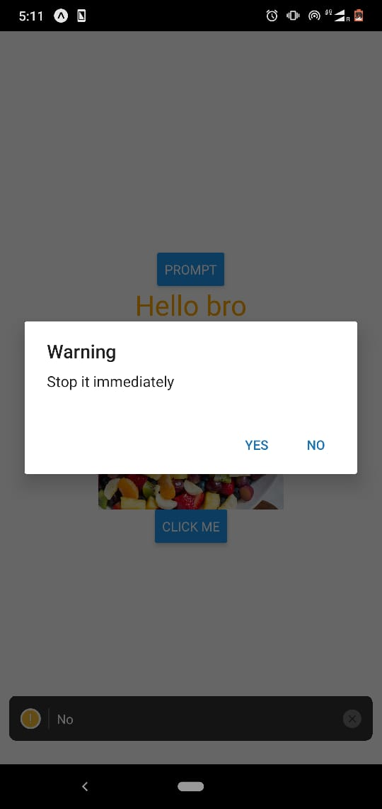
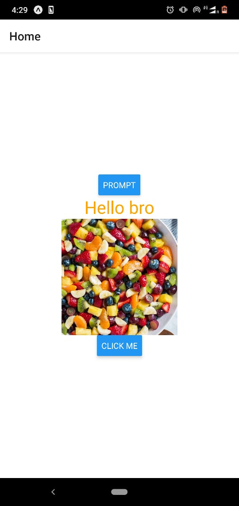
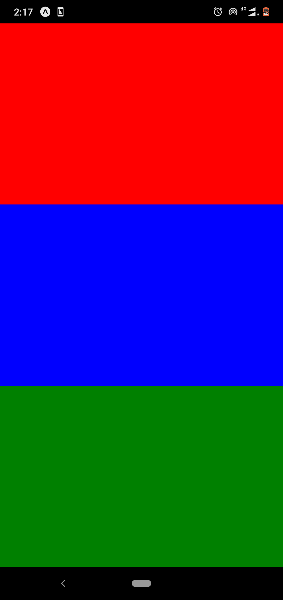
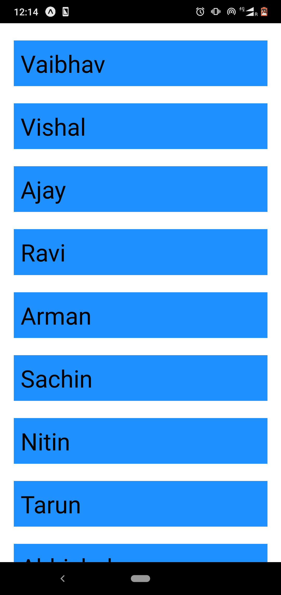
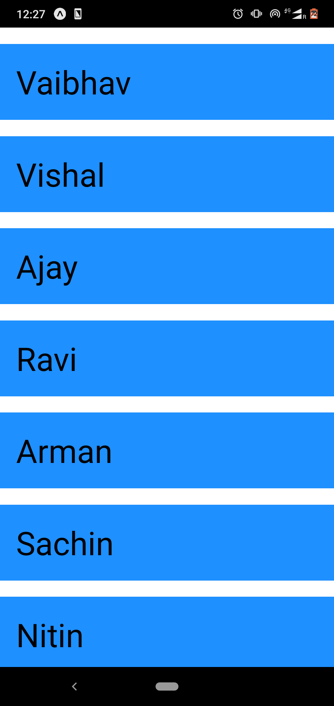
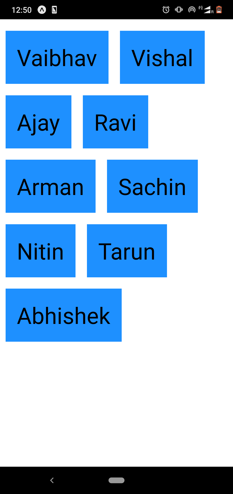
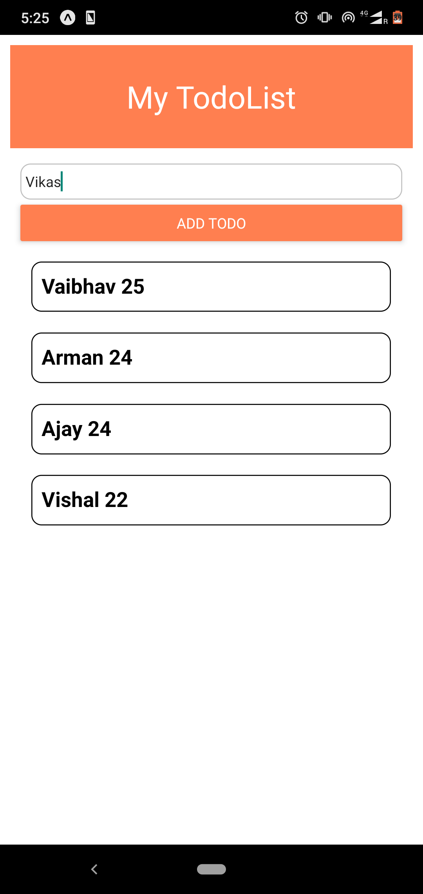
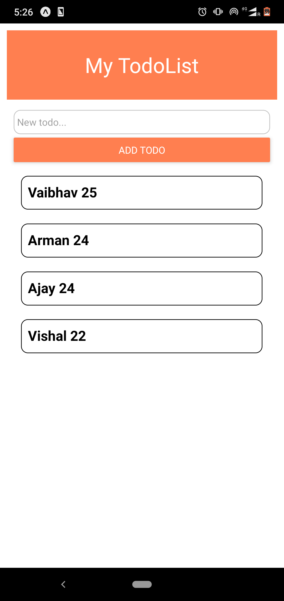
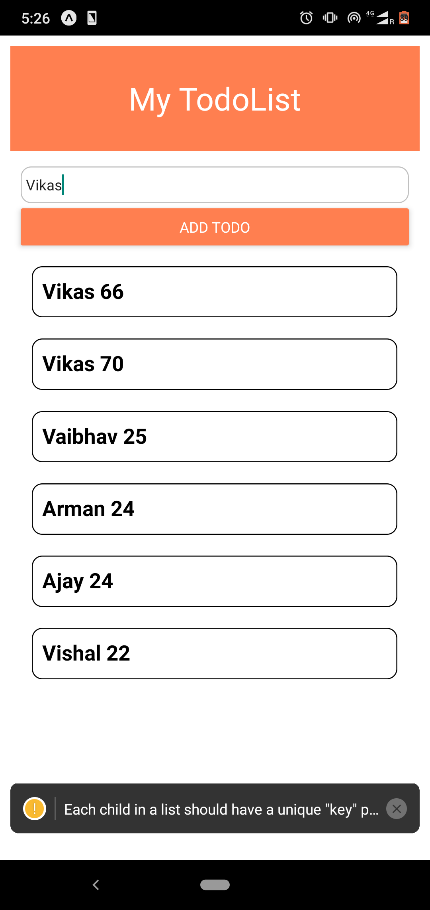

# practiveRN

## Step 1:-

1. Download First some Basic functional dependencies using Expo-cli `expo init`
2. Now on command line start yarn to use see the output on phone or Emulator by command `yarn start`

### Components:-

1.  `<View>` this is a component use to implement View in our Project it basicaly act as a `<Div>` in in React Native Project.
2.  `<Text>` it is used to render text on our project
3.  `<Image>` this is use to render Images in project its styntax is as follows

- `<Image source={require("./assets/icon.png")}/>` to render Image from local system.

-` <Image source={{uri:"https://www.cookingclassy.com/wp-content/uploads/2019/05/fruit-salad-2.jpg"}}/>` this is for image from URl.

4.  `<Button>` this is used to insert button on project it syntax is as `<Button title="Click Me" onPress={() =>console.warn('Button Pressed')}/>`.

5.  To get Dimension of Screen of the Device use the code as `console.log(Dimensions.get("screen"));`

### Orientation Setting

    -To set the Both orientiation for your all devices go to app.json file and change orientation from potrait mode to default.

# Initial Outputs are as




# FlexBox:-

1. FlexBoxs inside a view divide the area in ratios as per their assign sizes.
2. When we have a multiple line content `alignItems` property works for each line item specificaly. to align complete content use `alignContent`.
3. `alignContent` works only when have wraping of the content using `flexWrap` .
   

# Positioning

1. Absolute positioning will make the content move relative to it parent component and it disturbes the positioning of the other content of the parent component.
2. Relative positioning will make the content move relative to its current position it do not disturbs any other positions.


# Rendering a List:-

1. To render each item in List we use `map()` function.

### Syntax

```{people.map(item =>(
<View style={styles.container} key={item.key}>
<Text style={styles.listitems}>{item.name}</Text>
</View>
))}
```

- In Line 1 people is the name given to the array and to render it use people.map()
- To render items use any wird i am using `item` the implement an arrow function
- item are set in View and then in Text in View key is required to identify items specificaly thus used `key={item.key}`.
- after this simply render the items using item.name in my case my items in array have variable name.
  

2. ## FlatList:-

- In FlatList we dont have to use scrollView it default have this Features and Its Benefit is as it has small code to write and it did not loads the colplete list at once unlike List map feature infact it Loads items as we Scoll down example `Instagram and FaceBook`.

### Syntax:-

```<FlatList
          keyExtractor={(item)=>item.id}
          data={people}
          renderItem={({item})=>(
            <Text style={styles.listitems}>{item.name}</Text>
          )}
          />
```

- It takes to props for sure **data** and **renderItems** data takes input of name of list to be rendered and renderItem takes the function to render the item as above.
- Use key Extractor if there is no key property in list this keyExtractor line makes id property of item as key property.
  -renderItem accepts only on prop name in destructuring we can only use item for destructuring i.e., `({item})` if we pass anything it will not work




## Removing Item from array of USeState using onPress:-

1. In renderingItem function we call filter function it syntax is as:-

````renderItem={({item: kuchbhi})=>(
                        <EditList name={kuchbhi} presshandler={pressHandler}/>
                               )}```

 Now as presshandler is called it has filer method as below:-
 ```  const pressHandler =(item)=>{
        setStudent((currentState)=>{
            return(
                currentState.filter(Student=>Student.Sid!=item.Sid)
            );
        })};
````

in press handler here single item of array is passed and in setStudent is function of useState it renders each items of array now
`currentState.filter(Student=>Student.Sid != item.Sid)`
in this for every student item if Student id is not same as item id then it is kept in array if this conditions false the item of perticular id is removed.
**Note:-{In arrow function we can execute on thing or one fuction it cannot contain multiple functions or code}**

## Adding Elements to the array:-

1. for this we created Addlist component and Inseted text input with button.
2. in textinput onChangeText created a function which takes text typed as below

```const [text, setText]=useState('');
    const changeTextHandler=(val)=>{
        setText(val);
    }
```




and in this there is a usestate initial value with empty string and setText accepts value typed by user as val. 3. now the new value for item text is val then created function onpress of Button as `submithandler(text)` and it takes value of text and then its discription is as bellow in TodoList file and further it is passed to Addlist component as prop.

```const submitHandler=(text)=>{
            setStudent((prevarray)=>{
                return([
                    {Sname:text,  age: Math.round(Math.random()*100)},
                    ...prevarray
                ])
            })

        }
```

in ths text is the prop passed and setStudent of usestate of Todolist is called.
and renders each item as prevarray and then setStudent returns text passed added as an obj in Student array as `{Sname:text, age: Math.round(Math.random()*100)}` to this array to get added to list we do `...prevarray` ths adds the new abj to the start of the array.`...` is a Spred operator.
